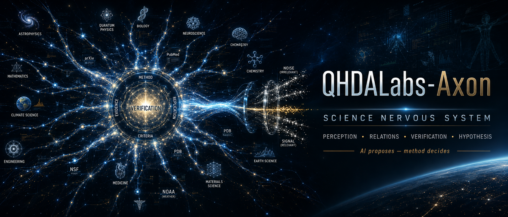

# Axon — the Science Nervous System (SNS)

<p align="center">
  
</p>

> Relational infrastructure over the scientific literature: the relation is the unit, and verification comes before discovery.

[](https://github.com/QHDALabs/QHDALabs-Axon/actions/workflows/ci.yml)
[](pyproject.toml)
[](pyproject.toml)
[](https://github.com/QHDALabs/qhda-core)
[](LICENSE)

**[Manifesto](Manifest.md)** · **[Verification log](VERIFICATION_LOG.md)** · **[qhda-core](https://github.com/QHDALabs/qhda-core)**

---

Infrastructure for getting a grip on the scientific literature, which grows by
millions of texts per year.

Axon is built on two theses:

1. **The fundamental unit is the relation, not the document.** Value is not in
   unread papers; it is in the unmet connections between papers that already
   exist — often across fields that do not talk to each other.
2. **Verification comes before discovery, never after.** Generating connections
   is cheap and most candidates are false. The hard, central work is rejecting
   the false ones. A system that cannot say "this link is spurious" is a noise
   generator, not science.

The conceptual contract is in [Manifest.md](Manifest.md) (Polish). The
methodological contract — verification before discovery, null results as
first-class data, honest scope claims — is in
[VERIFICATION_LOG.md](VERIFICATION_LOG.md).

> **Status: MVP + ABC bridge.** The pipeline runs end to end on small, fixed, **real**
> corpora for two relation kinds: `PROXIMITY` (lexical TF-IDF, empirical random-pair
> null, BH-FDR) and `ABC_BRIDGE` (Swanson closed discovery — two literatures linked
> through shared intermediate B-terms, with two explicit nulls). On a frozen pre-1986
> PubMed corpus the bridge verifier RECOVERS the known Raynaud / fish-oil connection
> (methodological validation, **not** a scientific discovery claim). The other
> mechanistic relation kinds are declared but unregistered (they fail closed). No
> benchmark claims, no fabricated metrics.

## Architecture — the order is the thesis

Axon is a four-stage pipeline. The order is not incidental; reversing it
(discover first, verify maybe later) produces exactly the inflation of false
findings the project exists to prevent.

```text
1. perception                 ingest scientific text -> normalized Document
2. relational_representation  build the map of relations (a relation store,
                              not a fact store) on qhda-core's relational layer
3. verification               criticise every candidate against an explicit
                              null; reject false positives before anything is
                              surfaced. THIS is the core.
4. hypothesis                 discoveries = the OUTPUT of verification; built
                              only from accepted results, never from raw
                              candidates
```

The thesis is enforced structurally: the hypothesis stage accepts only
`VerificationResult` objects (the output of verification) and raises on anything
else. There is no code path from a raw candidate to a hypothesis.

### Relational and quantum layers

Axon consumes [`qhda-core`](https://github.com/QHDALabs/qhda-core); it does not
vendor or reimplement it. qhda-core has two layers:

- a **relational layer** (pure numpy, always available) — used here for the
  relation store and its coherence-vs-noise signal;
- an optional **quantum layer** (Qiskit, an extra) — wired in only where it
  earns its place.

The relational path of Axon stays fully functional with Qiskit **not** installed,
mirroring qhda-core's dependency boundary.

## Install

Axon depends on [`qhda-core`](https://github.com/QHDALabs/qhda-core), which is
public on GitHub but **not** on PyPI. Install it first so Axon's dependency
resolves to it, then install Axon.

**From a clean clone:**

```bash
pip install "git+https://github.com/QHDALabs/qhda-core.git"
pip install .
```

**For development** (editable install against a sibling checkout):

```bash
pip install -e ../qhda-core
pip install -e ".[dev]"          # pytest, mypy, coverage
```

**With the optional quantum layer** (Qiskit):

```bash
pip install "qhda-core[quantum] @ git+https://github.com/QHDALabs/qhda-core.git"
pip install ".[quantum]"
```

## Quickstart

```python
from pathlib import Path
from axon import (
    ingest_corpus, TfidfFeaturizer, featurize_documents, RelationStore,
    RelationKind, RandomPairProximityVerifier, VerifierRegistry,
    verify_all, apply_fdr, surface_hypotheses,
)

# 1) perception: ingest the committed real corpus, then featurize (lexical TF-IDF;
#    this captures lexical proximity, NOT semantic/mechanistic equivalence).
docs = list(ingest_corpus(Path("data/corpus_mvp.json")))
docs = featurize_documents(TfidfFeaturizer(), docs)

# 2) relational representation: propose candidate proximity relations (cheap).
store = RelationStore(dim=docs[0].vector.shape[0])
for d in docs:
    store.observe(d)
candidates = store.candidate_relations(threshold=0.0)  # FDR is applied across all

# 3) verification: dispatch via a fail-closed registry to a verifier with an
#    explicit null; here the empirical random-pair null. Then FDR across the family.
registry = VerifierRegistry()
registry.register(RelationKind.PROXIMITY, RandomPairProximityVerifier())
results = apply_fdr(verify_all(candidates, registry, store), alpha=0.05)

# 4) hypothesis: surface only what survived FDR; nulls/rejected stay visible.
report = surface_hypotheses(results)
print(report.counts)        # full verdict breakdown — nulls stay visible
print(report.hypotheses)    # accepted only
```

A complete runnable version is in
[examples/mvp_proximity_null.py](examples/mvp_proximity_null.py):

```bash
python examples/mvp_proximity_null.py
```

### The null model, and an honest result

For `PROXIMITY` the null is **empirical**: the distribution of cosine similarity
over real document pairs drawn from the same corpus, **stratified** so each
candidate is compared only against random pairs matched on its confounders (domain
and a coarse length band). The candidate's own pair is excluded from its null.
(An earlier reference permuted vector *dimensions* — an invalid null for real text
vectors that only asks "more aligned than a random direction?"; see
[VERIFICATION_LOG.md](VERIFICATION_LOG.md).)

On the committed 40-document corpus, with BH-FDR applied across all 780 pairs,
**no proximity relation survives** (34 pairs are nominally significant at raw
p<0.05; none after FDR). That is the correct, reported outcome — an honest null,
not a failure. It also reflects a structural fact: an empirical same-corpus pair
null has a p-value floor of ~1/(stratum size), which cannot beat the
multiple-testing burden when *every* pair is tested. Surfacing only what survives
(here: nothing) is exactly the false-positive rejection the project exists for.

### Relation kinds (fail closed)

`RelationKind` declares `PROXIMITY` and `ABC_BRIDGE` (both implemented, each with
its own explicit null) plus placeholders (`SAME_MECHANISM_AS`, `SUPPORTS`,
`CONTRADICTS`, `MEASUREMENT_BRIDGE`). Only the implemented kinds have a registered
verifier; proposing any other kind **raises** (no silent fallback). No relation kind
ships without its own explicit null.

### ABC bridges (closed discovery)

A direct proximity verifier would correctly return NULL on Raynaud vs fish oil —
they share almost no surface vocabulary — and MISS the connection, which runs
through intermediate B-terms (blood viscosity, platelet aggregation,
vasoconstriction). `AbcBridgeVerifier` scores the B-mediated connection between two
literatures and tests it against two explicit nulls (random-literature-pair and a
shuffled-B null restricted to the shareable common pool), with B re-selected on
every null replica. The bridge signature is **low direct similarity, high mediated
connectivity**; a directly-similar pair is gated out as proximity.

On a frozen pre-1986 PubMed corpus ([data/bridge_corpus.json](data/bridge_corpus.json),
MeSH substrate) the verifier recovers the Raynaud / fish-oil bridge:
direct_sim=0.046, 34 B-terms (discovered, including `blood platelets`,
`arachidonic acid`, `aspirin`), passing both nulls (p=0.0345 random-pair, 0.0005
shuffled-B); accepted under closed-discovery FDR (family = the one pre-specified
pair; q=0.0345). Negative controls are rejected (scleroderma by the proximity gate,
dental caries as worse than chance).

```bash
python examples/abc_bridge_recovery.py
```

This is **methodological validation** (the statistic was shaped in-sample for this
known case), not a scientific claim. The closed-discovery FDR leniency (family of
one) is legitimate only because the pair was pre-specified; open discovery (scanning
many candidate C's) requires FDR across all of them. Held-out validation
(migraine / magnesium) is the next step. See
[VERIFICATION_LOG.md](VERIFICATION_LOG.md) for the full account, including the null
artifact that verify-first caught and fixed.

## Tests

```bash
pip install -e ".[dev]"
pytest
```

The test tree mirrors the package. The verification tests are the core: they
assert the verifier can return `NULL`/`REJECTED` for chance pairs and accepts
only genuine structure.

## What this is not

Axon does not produce truth, replace the scientist, or act as an oracle of
discovery (Manifest, III). It builds the conditions in which an answer can be
found — and trusted.

---

*QHDALabs | Krzysztof Banasiewicz*
